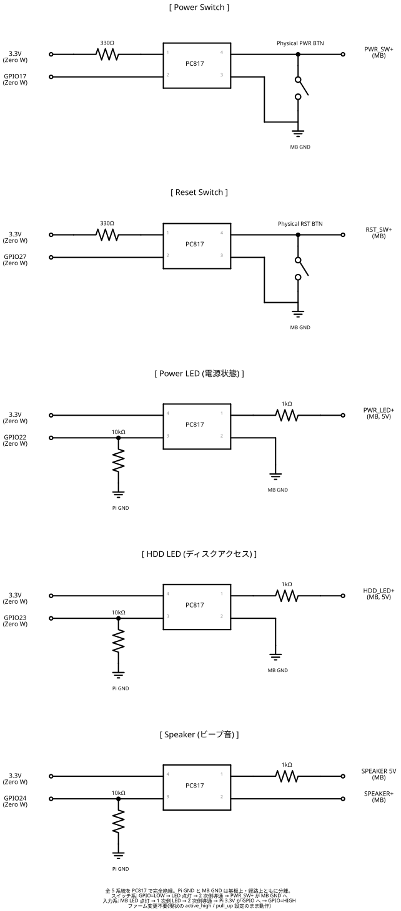

# PC Remote Power Controller

Raspberry Pi Pico W を使って、PCの電源をWiFi経由でリモート制御するデバイス。

REST APIで電源ON/OFF、リセット、ステータス確認が可能。物理電源ボタン・リセットボタンとの並列動作にも対応。

## 部品リスト

| 部品 | 数量 | 用途 | 備考 |
|------|------|------|------|
| Raspberry Pi Pico W | 1 | メインMCU | Pico WH（ヘッダー付き）でも可 |
| USBケーブル (Micro-B) | 1 | Pico W給電 | PC電源と独立したUSB充電器に接続 |
| デュポンケーブル（メス-メス）| 6本 | Pico W ↔ 基板 ↔ マザーボード | 2.54mmピッチ |
| ピンヘッダー 2.54mm（オス）| 2x3組(6本) | 基板上の中継端子 | ケースのコネクタを差し込む用 |
| ピンヘッダー 2.54mm | 必要分 | Pico Wへの配線用 | Pico WHなら不要 |
| 抵抗 3.3kΩ | 1 | Power LED分圧（下側） | 1/4W |
| 抵抗 6.8kΩ | 1 | Power LED分圧（上側） | 1/4W |
| ユニバーサル基板（小型） | 1 | 中継ボード・分圧回路の実装 | 2.54mmピッチ穴あき基板。全配線をはんだ付け |

## 回路図



- **Power Switch / Reset Switch**: 物理ボタンと並列接続。Pico W GPIO は通常 Hi-Z（切断状態）で、操作時のみ LOW を出力してスイッチ押下をシミュレート
- **Power LED**: 分圧抵抗（6.8kΩ + 3.3kΩ）で 5V → 約1.65V に降圧し、GP18 で安全に読み取り
- **パルス幅**: 電源ON = 500ms / 電源OFF = 5000ms / リセット = 500ms

> KiCad プロジェクトファイルは [hardware/](hardware/) ディレクトリにあります。

## 配線

### ユニバーサル基板中継ボードの構成

マザーボードのフロントパネルヘッダーは2ピンのため、ケースのボタンとPico Wのケーブルを同時に差せない。ユニバーサル基板を中継ボードとして使い、すべての配線をはんだ付けで集約する。

基板にピンヘッダー（オス）をはんだ付けし、ケースのコネクタ（デュポン メス）を差し込めるようにする。

```
ユニバーサル基板上のレイアウト:

  [PWR_SW 中継]
  ピンヘッダー A1 ──── ピンヘッダー A2    ← ケースの電源ボタン (メスコネクタを差す)
       │                    │
       │                    │
  MB PWR_SW+ へ        GND (共通)
  (デュポンケーブル)
       │
  Pico GP16 へ
  (デュポンケーブル)

  [RST_SW 中継]  ※同様の構成

  [PWR_LED 分圧回路]
  MB PWR_LED+ ── 6.8kΩ ──┬── Pico GP18 へ
                          │
                        3.3kΩ
                          │
                         GND
```

### 接続手順

1. **基板を製作**: ユニバーサル基板にピンヘッダー（オス）を PWR_SW 用に2本、RST_SW 用に2本はんだ付けし、裏面で配線をはんだ付け
2. **分圧回路を実装**: 同じ基板上に 6.8kΩ + 3.3kΩ の分圧回路をはんだ付け
3. **ケースのボタンを接続**: ケースの電源ボタン・リセットボタンのコネクタ（メス）をピンヘッダーに差し込む
4. **マザーボードと接続**: デュポンケーブル（メス-メス）で基板からマザーボードの PWR_SW / RST_SW / PWR_LED ヘッダーへ接続
5. **Pico W と接続**: デュポンケーブルで基板から Pico W の GP16 / GP17 / GP18 / GND へ接続
6. **Pico W を給電**: USB 充電器から Micro-B ケーブルで給電（PC電源と独立）

## セットアップ

### 1. MicroPython のインストール

1. [MicroPython公式サイト](https://micropython.org/download/RPI_PICO_W/)から Pico W 用の `.uf2` ファイルをダウンロード
2. Pico W の BOOTSEL ボタンを押しながら USB 接続
3. マウントされたドライブに `.uf2` ファイルをコピー

### 2. WiFi 設定

`config.py` の以下の値を自分の環境に合わせて変更:

```python
WIFI_SSID = "YOUR_SSID"
WIFI_PASSWORD = "YOUR_PASSWORD"
```

### 3. ファイル転送

Thonny 等の IDE で以下のファイルを Pico W に転送:

- `main.py`
- `config.py`
- `power.py`
- `wifi.py`
- `server.py`

### 4. 動作確認

1. Pico W を再起動（USBを抜き差し）
2. 内蔵LEDが点灯すれば WiFi 接続成功
3. シリアルコンソールで IP アドレスを確認
4. `curl http://<IP>/status` で疎通確認

## API

すべてのレスポンスは JSON 形式。

### GET /status

PC の電源状態を取得。

```bash
curl http://<IP>/status
```

```json
{"pc_power": true, "busy": false}
```

### POST /power/on

電源 ON（500ms パルス）。既に ON なら何もしない。

```bash
curl -X POST http://<IP>/power/on
```

```json
{"status": "power_on_sent", "pc_power": true}
```

### POST /power/off

電源 OFF（5秒長押し）。既に OFF なら何もしない。

```bash
curl -X POST http://<IP>/power/off
```

```json
{"status": "power_off_sent", "pc_power": false}
```

### POST /power/toggle

電源トグル（500ms パルス）。現在の状態に関わらず実行。

```bash
curl -X POST http://<IP>/power/toggle
```

```json
{"status": "toggle_sent", "pc_power": true}
```

### POST /reset

リセット（500ms パルス）。PC が OFF なら何もしない。

```bash
curl -X POST http://<IP>/reset
```

```json
{"status": "reset_sent", "pc_power": true}
```

### エラーレスポンス

```json
{"error": "not_found", "path": "/unknown"}
```

## 注意事項

- パルス送信直後の `pc_power` は状態変化前の値の場合がある（数秒後に `/status` で再確認推奨）
- WiFi SSID とパスワードは `config.py` に平文で記述される
- Pico W は USB 給電で常時動作するため、PC 電源が OFF でもリモート操作可能

## ライセンス

MIT
