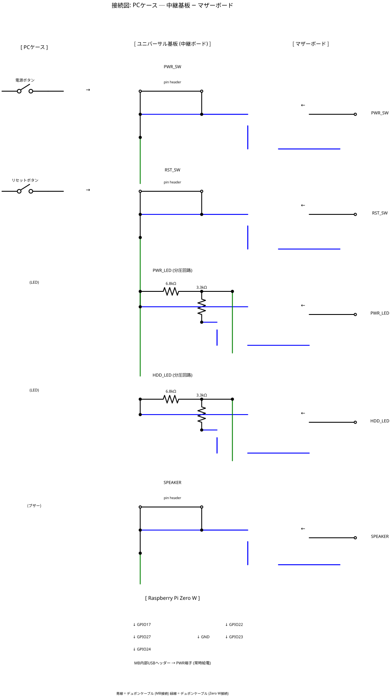

# PC Front Panel Wireless Bridge

Raspberry Pi Zero W を使って、マザーボードのフロントパネルピンヘッダーを無線化するデバイス。

PC電源のON/OFF/リセットをリモート操作し、電源状態・ディスクアクセス・ビープ音をWebSocketでリアルタイム配信する。Web UIとREST APIの両方に対応。

## 機能

| 機能 | 方向 | 方式 |
|------|------|------|
| 電源 ON/OFF | 制御 | REST API / Web UI |
| リセット | 制御 | REST API / Web UI |
| 電源状態 (PWR_LED) | 監視 | WebSocket リアルタイム |
| ディスクアクセス (HDD_LED) | 監視 | WebSocket リアルタイム |
| ビープ音 (SPEAKER) | 監視 | WebSocket リアルタイム |

## 部品リスト

| 部品 | 数量 | 用途 |
|------|------|------|
| Raspberry Pi Zero W | 1 | メインボード |
| microSD カード | 1 | Raspberry Pi OS |
| USB内部ケーブル | 1 | MB内部USBヘッダー → Zero W PWR端子 |
| デュポンケーブル（メス-メス）| 10本 | Zero W ↔ 基板 ↔ マザーボード |
| ピンヘッダー 2.54mm（オス）| 10本 | 基板上の中継端子 |
| 抵抗 3.3kΩ | 2 | PWR_LED / HDD_LED 分圧（下側） |
| 抵抗 6.8kΩ | 2 | PWR_LED / HDD_LED 分圧（上側） |
| ユニバーサル基板（小型） | 1 | 中継ボード・分圧回路 |

## GPIO 割り当て

| GPIO | 方向 | 接続先 | 備考 |
|------|------|--------|------|
| GPIO17 | 出力 | PWR_SW ヘッダー | 通常Hi-Z、操作時LOW |
| GPIO27 | 出力 | RST_SW ヘッダー | 通常Hi-Z、操作時LOW |
| GPIO22 | 入力 | PWR_LED ヘッダー | 分圧抵抗経由 |
| GPIO23 | 入力 | HDD_LED ヘッダー | 分圧抵抗経由 |
| GPIO24 | 入力 | SPEAKER ヘッダー | |

## 回路図


### 分圧回路（PWR_LED / HDD_LED 共通）

マザーボードのLEDヘッダーは5V出力の場合があるため、分圧抵抗でGPIOを保護する。

```
LED+ (5V) ── 6.8kΩ ──┬── GPIO (≈1.65V)
                      │
                    3.3kΩ
                      │
                     GND
```

## 配線

### 接続図



### 接続手順

1. **基板を製作**: ユニバーサル基板にピンヘッダーをはんだ付け（PWR_SW / RST_SW / HDD_LED 各2本、SPEAKER 2本）
2. **分圧回路を実装**: PWR_LED用・HDD_LED用の分圧回路を基板上にはんだ付け
3. **ケースのボタンを接続**: 電源ボタン・リセットボタンのコネクタをピンヘッダーに差し込む
4. **マザーボードと接続**: デュポンケーブルで基板からマザーボードの各ヘッダーへ接続
5. **Zero W と接続**: デュポンケーブルで基板から Zero W の各GPIOへ接続
6. **Zero W を給電**: マザーボード内部USBヘッダーから Zero W の PWR端子（OTG側ではない方）に接続

### 給電について

マザーボード内部USBヘッダーから給電する。BIOSで **USB Standby Power** を有効にすれば、PCシャットダウン中もZero Wが動作し続ける。

- BIOS設定例: 「USB Standby Power」「USB Power in S5」「ErP Ready → Disabled」
- メーカーにより設定名が異なる

## セットアップ

### 1. Raspberry Pi OS のインストール

1. [Raspberry Pi Imager](https://www.raspberrypi.com/software/) で microSD に Raspberry Pi OS Lite を書き込む
2. Imager の設定で WiFi・SSH を有効化
3. microSD を Zero W に挿入、USBで給電して起動

### 2. アプリのインストール

```bash
git clone https://github.com/cathandnya/pc_power.git
cd pc_power
./install.sh
```

### 3. 動作確認

ブラウザで `http://<Zero W の IP>:8080` にアクセス。

## Web UI

Zero W 上で Web UI が直接ホストされる。別サーバー不要。

- 電源状態・ディスクアクセス・ビープ音をリアルタイム表示
- Power ON / Power OFF / Reset ボタン
- WebSocket で自動更新（ポーリング不要）

## REST API

### GET /status

```bash
curl http://<IP>:8080/status
```

```json
{"pc_power": true, "hdd_active": false, "beep": false, "busy": false}
```

### POST /power/on

```bash
curl -X POST http://<IP>:8080/power/on
```

```json
{"status": "power_on_sent", "pc_power": true}
```

### POST /power/off

```bash
curl -X POST http://<IP>:8080/power/off
```

### POST /power/toggle

```bash
curl -X POST http://<IP>:8080/power/toggle
```

### POST /reset

```bash
curl -X POST http://<IP>:8080/reset
```

## WebSocket

`ws://<IP>:8080/ws` に接続すると、GPIO状態が変化するたびにJSONが配信される。

```json
{"pc_power": true, "hdd_active": true, "beep": false, "busy": false}
```

## iOS ショートカット

| 操作 | URL | メソッド |
|------|-----|----------|
| 電源ON | `http://<IP>:8080/power/on` | POST |
| 電源OFF | `http://<IP>:8080/power/off` | POST |
| リセット | `http://<IP>:8080/reset` | POST |
| 状態確認 | `http://<IP>:8080/status` | GET |

## ライセンス

MIT
